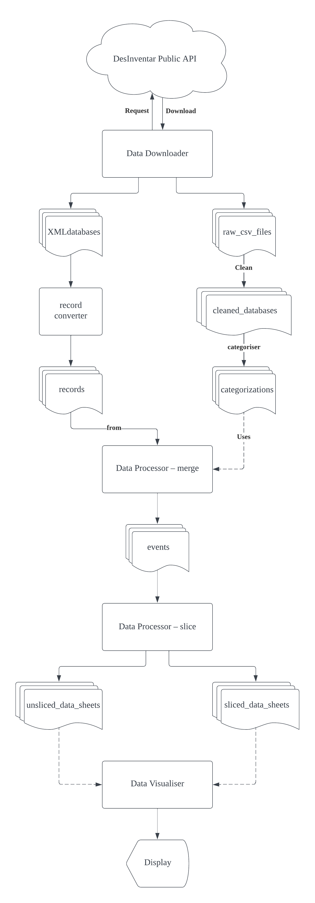

# data-downloader

A simple data downloader for the [DesInventar](https://www.desinventar.net).

This tool is a part of a UCL IXN project: "[Define return periods for low-impact 
hazardous events](https://github.com/COMP0016-IFRC-Team5/data-visualiser/blob/main/README.md#project-introduction)" with IFRC. 

## Installation

```bash
git clone https://github.com/COMP0016-IFRC-Team5/data-downloader.git
cd data-downloader
```

## Requirements

Install dependencies in any preferred way

- Using conda ([Anaconda](https://docs.anaconda.com/anaconda/install/index.html) or [Miniconda](https://docs.conda.io/en/latest/miniconda.html))
```bash
conda env create -f conda_env.yml
conda activate data-downloader
```

- Using pip ([Python 3.10+](https://www.python.org/downloads/))
```bash
pip install -r requirements.txt
```

## Introduction
The following diagram shows the dependency of the data.


### Description to each module in this repository
- `xml_downloader`: since the xml databases are major data source, we use this 
module to download xml files and from DesInventar.
- `csv_downloader`: as the data-processor module (in another repository) needs
  the categorisations generated by this module, we use this module to acquire
  all disaster types in order to generated categorisations.
- `categoriser`: generates the categorisations based on the disaster types 
  obtained by `csv_downloader`.
- `record_converter`: The data-processor module needs event records in xml 
  databases but in csv format. Therefore, we use this module to extract the 
  records and convert them to csv format.

## Usage

This module provides functionality for downloading data from DesInventar to the 
target directory.

You need to download xml and csv files from DesInventar using its corresponding
module.
Then you need to convert xml to csv using `record_converter` module. This step 
may use 60 GB of memory.
Finally, you can use `categoriser` module to generate categorisations for the 
events.

### Note for the `csv_downloader` module
In this code snippet, `target_dir` is the directory where the csv files will be
downloaded to.
```python
import csv_downloader
csv_downloader.start_download(target_dir='./data', mode=0b000)
```

`mode` is an integer from 0 to 7, whose highest bit determines whether ignore
existing spreadsheets and last two bits determine the level of ignoring of
caches.

Let `ignore_cache = mode & 0b011`  
If `ignore_cache` is greater than 0, the crawler will ignore cache in
`caches/disasters.pkl`. If `ignore_cache` is greater than 1, the crawler will
ignore cache in `caches/disasters.pkl` and `caches/disasters/*`.
If `ignore_cache` is greater than 2, all caches will be ignored.

### Example:
See `example.py` for detail.

```bash
python3 example.py
```

## Customise

### `xml_downloader`

The country information was obtained from the DesInventar Download page 
(https://www.desinventar.net/download.html). If you want to maintain the list
of the countries, you need to manually go the webpage and inspect the 
hyperlinks to get its country code. 

For example, for Comoros, the html tag is
```html
<a href="/DesInventar/download_base.jsp?countrycode=com" target="_blank">
    Comoros
</a>
```
Its country code is `com`.

The code containing country information is located in 
`xml_downloader/_country_info.py`. If DesInventar adds a country in the future, 
with name `CountryName` and country code `ctn`, then you need to append `ctn` 
to the list `country_code` and append `CountryName` to the list `country_name`.

### `csv_downloader`
You can delete statement `remove_empty_databases()` in `start_clean()` function 
of `_cleaner.py` if you don't want to delete empty csv files (The contents of
the files are not used).

#### Future development
After running `__get_country_disaster_dict()` in `_csv_crawler.py`, we have 
disaster types acquired from DesInventar. Therefore, there is no need to 
download the csv files with disaster type. However, changes need to be made for
`categoriser` to adapt the new way of acquiring the disaster types rather than
from disk.

### `categoriser`
Categorisation information is stored in the `_categorisations.py`. If you want 
to move some subtypes to another major type, you need to modify this file.

### `record_converter`
Currently, the record converter reads the entire xml file into the memory. 
Therefore, for large xml files like `Sri Lanka.xml` (1.2 GB), it may take more 
than 60 GB of RAM to process this file.

For future development, you may want to change it to parse the file element by 
element. Here is the information you may need:
- The records of an xml file are under `DESINVENTAR.fichas` with tag name `TR`.
- Once you have the tag for a record, you can use `RecordFactory.from_tag()` to
  generate a `Record` to you.
- After you get the full list of the records, you can use 
  `list(map(lambda rec: rec.as_dict(), records))` to obtain the converted 
  records as a list of dictionary.
- Finally, you can use `df = pd.DataFrame.from_dict(converted_records)` to get
  a pandas dataframe for all of the records. The rest of the work will be done 
  by `__convert_database()` in `_main.py`.

## License

[MIT](https://choosealicense.com/licenses/mit/)

## Authors

- Dekun Zhang    [@DekunZhang](https://www.github.com/DekunZhang)
